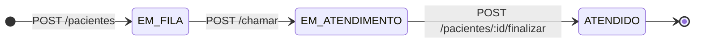

# MicroSUS API


API em Java que simula o fluxo de triagem hospitalar, operando diretamente sobre TCP Sockets na camada de transporte, sem a utilização de frameworks ou bibliotecas de roteamento externas, permitindo a aplicação de conceitos fundamentais de redes e concorrência de threads.

| Branch | Implementação |
| ------ | ------------- |
| [**`checkpoint/01`**](https://github.com/barbarastella/microsus-api/tree/checkpoint/01) | Servidor TCP, HTTP Parser, roteamento básico, cadastro de pacientes, server-side rendering da fila |
| [**`checkpoint/02`**](https://github.com/barbarastella/microsus-api/tree/checkpoint/02) | Máquina de estados finalizada, rotas completas de triagem, rota de estatísticas, autenticação para POST |
| [**`main`**](https://github.com/barbarastella/microsus-api/tree/main) | Projeto completo, com suporte a multithreading e autenticação via token |

## 🔴 Funcionalidades

- [x] Parseamento completo de requisições HTTP (request line, headers e body via buffers) extraídas diretamente do InputStream do socket;

- [x] Montagem de respostas HTTP válidas, manipulando explicitamente os status codes, envio de headers obrigatórios e terminação correta com CRLF (`\r\n`);

- [x] Implementação de um Front Controller para interceptar e rotear dinamicamente as requisições baseadas no cruzamento de método (GET/POST) e path da URL;

- [x] Gerenciamento em memória utilizando a Stream API do Java para atuar como uma fila de prioridade, respeitando critérios de gravidade (VERMELHO, AMARELO, VERDE) e ordem de chegada (FIFO em caso de empate);

- [x] Implementação de uma máquina de estados para impedir transições ilegais na jornada do paciente;

- [x] Retorno dinâmico de página HTML formatada para endpoints visuais (GET /fila), com estilização vinculada às regras de negócio;

- [x] Arquitetura concorrente utilizando a criação dinâmica de threads para alocar cada conexão TCP em um fluxo de execução independente, prevenindo o bloqueio do servidor;

- [x] Implementação de autenticação baseada em tokens UUID via POST /login, com middleware de proteção que exige o envio do header Authorization nas rotas de mutação de estado.

## 🟡 Endpoints

### Máquina de estados

Para garantir a integridade do fluxo hospitalar, a API implementa uma **máquina de estados finitos (FSM)** que rege o ciclo de vida estrito de cada paciente. 



Ao dar entrada no sistema, o paciente é alocado imediatamente com o estado `EM_FILA`. Quando acionado para consulta, ele transita obrigatoriamente para `EM_ATENDIMENTO`. Ao receber o prognóstico, o registro é selado como `ATENDIDO` (estado terminal). O gerenciador utiliza guard clauses para impedir qualquer quebra ou salto nessa hierarquia lógica (exemplos: tentar dar alta a um paciente que ainda aguarda na recepção; modificar os dados de um atendimento já finalizado), barrando a requisição imediatamente com uma exceção `409 Conflict`.

### Tabela de rotas

```text
Legenda das tabelas:
[🌐] Público: não requer autenticação;
[🔒] Protegido: requer o envio do token UUID gerado no login através do header Authorization.
```

| Método | Rota | Descrição | Status Code | Transição de estado | Retorno | Acesso |
| :--- | :--- | :--- | :--- | :--- | :--- | :--- |
| **POST** | `/login` | Valida credenciais e gera a chave de sessão | `200` ou `403` | N/A | `JSON` | 🌐 |
| **POST** | `/pacientes` | Cadastra um novo paciente | `201` Created | `[*] ➔ EM_FILA` | `JSON` | 🔒 |
| **POST** | `/chamar` | Chama o próximo paciente respeitando a prioridade | `200` OK | `EM_FILA ➔ EM_ATENDIMENTO`| `JSON` | 🔒 |
| **POST** | `/pacientes/:id/finalizar`| Dá alta ao paciente registrando o prognóstico | `200` OK | `EM_ATENDIMENTO ➔ ATENDIDO`| `JSON` | 🔒 |
| **GET** | `/fila` | Renderiza a tabela visual de pacientes aguardando | `200` OK | N/A | `HTML` | 🌐 |
| **GET** | `/estatisticas` | Retorna os totais por estado, prioridade e geral | `200` OK | N/A | `JSON` | 🌐 |

### Exemplo de requisição (autenticada)

```http
POST /pacientes HTTP/1.1
Host: localhost:5555
Authorization: 550e8400-e29b-41d4-a716-446655440000
Content-Type: application/json
Content-Length: 77

{
  "nome": "Bárbara",
  "sintoma": "Enxaqueca",
  "prioridade": "AMARELO"
}
```

## 🟢 Execução

**Pré-requisitos**: [Java JDK](https://www.oracle.com/java/technologies/downloads/) (versão 11 ou superior) instalado.

```bash
# Clone o repositório
git clone https://github.com/barbarastella/microsus-api
cd microsus-api

# Compile o projeto
javac -d bin -sourcepath src/main/java src/main/java/com/ifsul/microsus/Server.java

# Inicie o servidor (porta pré-definida: 5555)
java -cp bin com.ifsul.microsus.Server
```

> **Observação**: As credenciais padrão para acesso às rotas POST são: **usuário `admin`** / **senha `123456`**.

## 🔵 Contato

<p align="left">
  Em caso de dúvidas ou comentários, entre em contato:&nbsp;
  
  <a href="https://www.linkedin.com/in/barbara-wehrmann/" title="LinkedIn">
    
  </a>
  <a href="mailto:barbarastellaw@gmail.com" title="Gmail">
    
  </a>
  <a href="https://www.instagram.com/barbarastellaw" title="Instagram">
    
  </a>
</p>